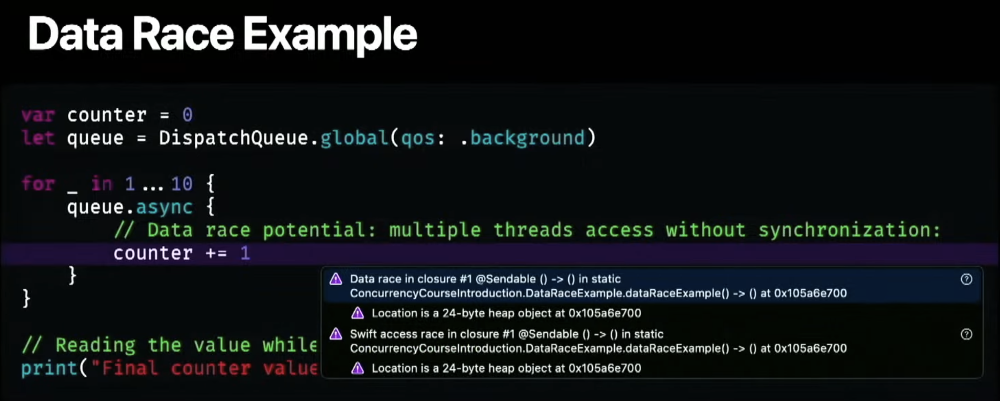

# Xcode Tips and Tricks

Essential Xcode Tips and Tricks to Boost Your Productivity

## First Set Up

- Enable Thread Sanitizer: Edit Scheme... -> Run -> Diagnostics -> Check Thread Sanitizer.



## Command Line Tools

Unlock Efficiency: Must-Know Xcode Commands for Developers

```bash
# Customize simulator status bar
xcrun simctl status_bar booted override --time 9:41 --cellularBars 1 --wifiBars 1 --batteryLevel 8
# Clear the status bar customize
xcrun simctl status_bar booted clear
```

[**View More...**](/md/COMMAND%20LINE%20TOOLS.md)

## Keyboard Shortcuts

Speed Up Development with Xcode’s Best Keyboard Shortcuts

| Keys      | Functions          |
| --------- | ------------------ |
| **⌘ + B** | Build your App     |
| **⌘ + R** | Run your App       |
| **⌘ + U** | Unit test your App |

[**View More...**](/md/KEYBOARD%20SHORTCUTS.md)

## Themes

Personalize Your Workspace: Must-Know Xcode Theme Tips

## Templates

Create Once, Reuse Forever: Essential Xcode Template Tips

- [IDETemplateMacros.plist](/plist/IDETemplateMacros.plist):
  - Define default values for certain placeholders in new projects.
  - Locate/Create the File under _~/Library/Developer/Xcode/UserData_

## macOS Commands

Control Your Mac Like a Pro with These Terminal Commands

```bash
# Check macOS version
% sw_vers
ProductName:      macOS
ProductVersion:   15.0.1
BuildVersion:     24A348
```

[**View More...**](/md/MACOS%20COMMANDS.md)
